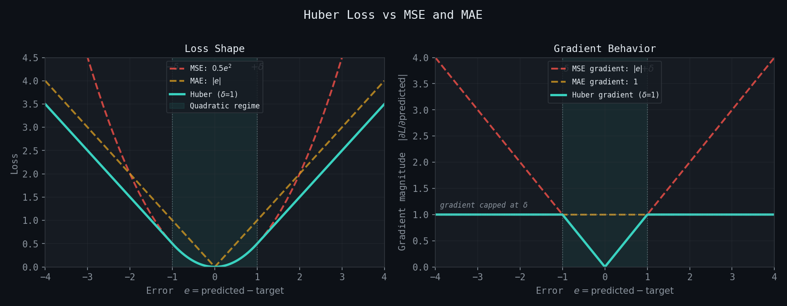
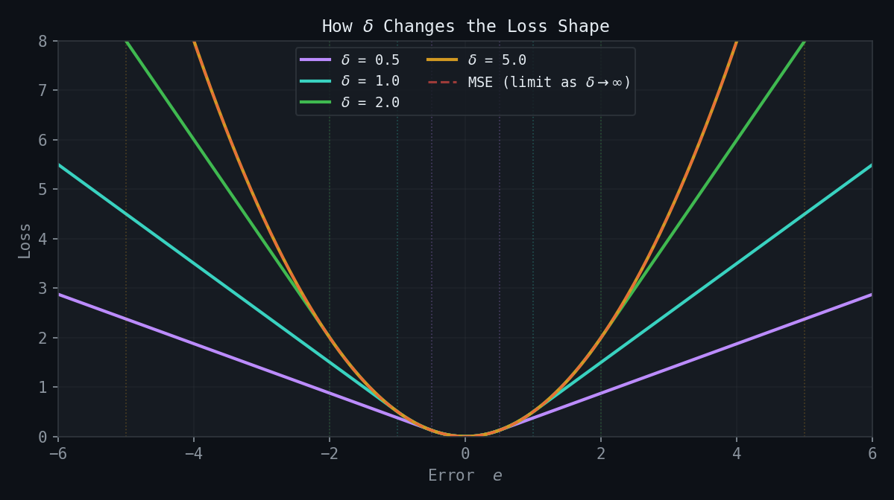

# How It Works: GNNs for Bathymetric Noise Detection

This document explains the theory behind Graph Neural Networks and how this tool applies them to bathymetric data cleaning.

> **Sign Convention:** This document uses the standard bathymetric convention where **depths are positive down**. A depth of 10m means 10 meters below the water surface. Larger values = deeper water.
>
> Since 2026-06-09 this convention is ENFORCED in code: `BathymetricLoader`
> normalizes every source (including BAG elevation, which GDAL reads
> negative-down) to positive-down on load, and the dataset refuses ground
> truth whose median depth is negative. Before that date the convention was
> assumed but not enforced, and the negative-down data silently inverted every
> direction-sensitive semantic in this document (see LESSONS_LEARNED
> Lesson 20). The sign math below is correct for all data produced after the
> fix.

## The Problem

Bathymetric surveys measure seafloor depth using acoustic sonar. The raw data contains noise from various sources:

| Noise Source | Appearance | Challenge |
|--------------|------------|-----------|
| Water column returns | Spikes above seafloor | Can look like real features |
| Multipath reflections | Systematic offsets | Depth-dependent patterns |
| Refraction errors | Smooth distortions | Hard to distinguish from slopes |
| System noise | Random speckle | Mixed with real texture |

**The core challenge:** Some noise looks like real seafloor features, and some real features look like noise. A spike on a flat seafloor is almost certainly noise, but the same spike in a rocky area might be a real rock.

```
Flat seafloor + spike = probably noise
Rocky area + spike = probably real feature
```

**Context matters.** This is why we use Graph Neural Networks.

### Shoal Spikes Are Critical

While noise can create spikes in both directions (shoaler or deeper), **shoal spikes are the primary concern** for navigation safety:

| Spike Direction | Depth Change | Safety Impact |
|-----------------|--------------|---------------|
| **Shoal** (shallower) | 10m → 5m | **Critical** - vessel could run aground on uncharted shallow |
| Deep (deeper) | 10m → 15m | Lower risk - vessel has more clearance than expected |

A false shoal spike that gets removed is a missed hazard. A real shoal feature that gets classified as noise is dangerous. This asymmetry means the model should be **conservative about removing shoal spikes** - when uncertain, preserve them for human review.

### Protecting Uncharted Features

A common concern: how do we prevent the model from cleaning away a real but uncharted feature (a new wreck, rock outcrop, or obstruction)?

**Multiple layers of protection:**

| Protection Layer | How It Works | Status |
|------------------|--------------|--------|
| **Confidence thresholds** | Low-confidence classifications are flagged for human review, not auto-corrected | ✓ Active |
| **Sidecar GeoTIFF** | All changes are documented with classification and confidence, enabling review | ✓ Active |
| **Conservative defaults** | Auto-correct threshold (0.85) means only high-confidence noise is touched | ✓ Active |
| **Feature class training** | Model learns to recognize feature-like patterns from ENC examples | Phase 3 (planned) |

**Current state:** With only synthetic noise training, the model classifies points as seafloor (0) or noise (2). Feature class (1) training is planned for Phase 3 when ENC feature labels are integrated.

**The key insight:** A properly trained model learns what features *look like*, not just where charted features *are*. When trained on diverse seafloor types including rocky terrain and known features, the model learns patterns like:

- Isolated spike on flat bottom → likely noise
- Spike connected to similar-depth neighbors → likely real feature
- Spike with low uncertainty in variable terrain → likely real feature

**For truly novel features** (something the model has never seen), the confidence score will typically be lower because the model is uncertain. These get flagged for human review rather than auto-corrected.

---

## Why Graphs?

Traditional approaches treat each depth measurement independently:

```
Point-by-point filtering:
┌─────────────────────────────────────┐
│  For each point:                    │
│    - Look at local statistics       │
│    - Apply threshold                │
│    - Classify as noise or not       │
└─────────────────────────────────────┘
```

This misses spatial context. A point's classification should depend on its neighbors.

**Graphs explicitly encode spatial relationships:**

```
Grid data:                    Graph representation:
┌───┬───┬───┬───┐            
│ A │ B │ C │ D │             A ── B ── C ── D
├───┼───┼───┼───┤             │    │    │    │
│ E │ F │ G │ H │   ──────►   E ── F ── G ── H
├───┼───┼───┼───┤             │    │    │    │
│ I │ J │ K │ L │             I ── J ── K ── L
└───┴───┴───┴───┘            
```

Each grid cell becomes a **node**. Connections between neighbors become **edges**.

---

## Graph Neural Network Basics

### Components of a Graph

| Component | What It Represents | In Bathymetric Data |
|-----------|-------------------|---------------------|
| **Nodes** | Individual data points | Grid cells with depth values |
| **Edges** | Connections between points | Spatial adjacency (neighbors) |
| **Node features** | Properties of each point | Depth, local statistics, gradients, curvature, log_footprint (resolution) |
| **Edge features** | Properties of connections | Distance, depth difference, slope angle |

### Message Passing

GNNs work through **message passing**: each node collects information from its neighbors to update its own representation.

```
Step 1: Each node has initial features
        ┌───┐     ┌───┐     ┌───┐
        │ A │ ─── │ B │ ─── │ C │
        └───┘     └───┘     └───┘
        depth     depth     depth
        = 10m     = 15m     = 10m
                  (spike!)

Step 2: Node B collects "messages" from neighbors A and C
        
        A says: "I'm at 10m depth, pretty flat here"
        C says: "I'm at 10m depth, same as A"
        
Step 3: B updates its representation using neighbor info
        
        B now knows: "My neighbors are both at 10m,
                      but I'm at 15m - that's a 5m spike
                      which looks anomalous"
```

This happens for **all nodes simultaneously**, then repeats for multiple **layers**. Each layer expands the receptive field:

```
Layer 1: Each node knows about immediate neighbors (1-hop)
Layer 2: Each node knows about neighbors-of-neighbors (2-hop)
Layer 3: Each node knows about 3-hop neighborhood
...
```

After several layers, each node's representation encodes information about its broader spatial context.

### Attention Mechanism (GAT)

This tool uses **Graph Attention Networks (GAT)**. The key idea: not all neighbors are equally important.

```
Standard message passing:
    Node B = average(A, C)           # Equal weights

Attention-based:
    Node B = 0.8 × A + 0.2 × C       # Learned weights
```

The attention weights are learned during training. The network might learn:
- "Pay more attention to neighbors at similar depths"
- "Ignore neighbors that also look noisy"
- "Weight upslope neighbors differently than downslope"

### How Attention Weights Are Learned

Attention weights aren't hand-coded rules - they emerge from training on diverse examples. The network learns **which neighbors matter** by seeing many examples of noise vs. real features across different conditions.

#### The Learning Process

```
For each training example:
1. Network makes predictions using current attention weights
2. Compare predictions to ground truth labels
3. Calculate error (loss)
4. Adjust attention weights to reduce error
5. Repeat thousands of times across diverse surveys
```

The key insight: **attention weights that work across diverse conditions are the ones that capture real patterns**, not artifacts of a specific survey type.

#### Why Training Diversity Matters

Each dimension of diversity teaches the network different aspects of "what matters":

| Training Diversity | What Attention Learns |
|--------------------|----------------------|
| **Depth ranges** | Shallow water has different noise characteristics than deep water. Attention learns depth-appropriate neighbor weighting. |
| **Seafloor types** | On flat mud, any spike is suspicious. On rocky terrain, spikes are normal. Attention learns to assess spikes relative to local texture. |
| **Noise severity** | Light noise looks different from heavy contamination. Attention learns to recognize noise patterns at different intensities. |
| **Equipment types** | Different sonars produce different noise signatures. Attention learns equipment-invariant features. |
| **Geographic regions** | Water column properties vary by region. Attention learns to generalize across oceanographic conditions. |

#### Concrete Example: Learning from Depth Diversity

Consider how depth diversity affects what attention learns:

```
Shallow survey (5-20m):
┌────────────────────────────────────────────────────────────┐
│ - Water column noise common (fish, bubbles, turbulence)    │
│ - Spikes often isolated, clearly noise                     │
│ - Network learns: "isolated shallow spikes = high noise    │
│   probability, weight similar-depth neighbors heavily"     │
└────────────────────────────────────────────────────────────┘

Deep survey (100-500m):
┌────────────────────────────────────────────────────────────┐
│ - Less water column interference                           │
│ - Multipath and refraction errors more common              │
│ - Systematic patterns across swaths                        │
│ - Network learns: "check across-track neighbors for        │
│   systematic offsets, not just local spikes"               │
└────────────────────────────────────────────────────────────┘
```

If trained only on shallow surveys, the network might learn attention patterns that fail on deep water (and vice versa). Training on both teaches **depth-invariant** attention.

#### Concrete Example: Learning from Seafloor Diversity

```
Flat mud seafloor:
┌────────────────────────────────────────────────────────────┐
│ Depths: 50, 50, 50, 55, 50, 50, 50                         │
│                      ↑                                     │
│                   spike                                    │
│                                                            │
│ All neighbors are ~50m, spike stands out                   │
│ Network learns: "when neighbors are uniform, even small    │
│   deviations are suspicious - weight ALL neighbors"        │
└────────────────────────────────────────────────────────────┘

Rocky outcrop:
┌────────────────────────────────────────────────────────────┐
│ Depths: 48, 52, 47, 55, 53, 49, 51                         │
│                      ↑                                     │
│                   same value, but context differs          │
│                                                            │
│ Neighbors vary naturally, 55m fits the pattern             │
│ Network learns: "when neighbors are variable, assess       │
│   whether spike fits local texture - weight SIMILAR        │
│   neighbors more than dissimilar ones"                     │
└────────────────────────────────────────────────────────────┘
```

Training on both seafloor types teaches the network to **adapt attention based on local context**.

#### What Happens Without Diversity

| Missing Diversity | Failure Mode |
|-------------------|--------------|
| Only flat seafloors | Network flags all texture as noise, removes real rocky features |
| Only shallow water | Network misses deep-water systematic errors |
| Only light noise | Network under-confident on heavily contaminated surveys |
| Only one sonar type | Network fails on different equipment |

This is why the training plan emphasizes collecting **diverse** ground truth pairs, not just **many** pairs.

#### Multi-Head Attention

The GAT architecture uses **4 attention heads**, meaning it learns 4 different attention patterns simultaneously:

```
Head 1: Might learn "weight neighbors by depth similarity"
Head 2: Might learn "weight neighbors by uncertainty"
Head 3: Might learn "weight upslope vs downslope differently"
Head 4: Might learn "weight by distance"

Final output = combination of all 4 perspectives
```

Each head can specialize in different aspects of the problem. Diverse training data gives each head enough examples to learn meaningful patterns.

---

## How This Tool Works

### Step 1: Build the Graph

The bathymetric grid is converted to a graph:

```python
# Each valid cell becomes a node
# Neighboring cells are connected by edges

Grid (5x5):                    Graph:
┌────┬────┬────┬────┬────┐    
│ 10 │ 10 │ 11 │ 10 │ 10 │     Nodes: 25 (one per cell)
├────┼────┼────┼────┼────┤     Edges: ~80 (8-connectivity)
│ 10 │ 10 │ 15 │ 10 │ 10 │     
├────┼────┼────┼────┼────┤     Node at (2,2) has depth 15m
│ 11 │ 15 │ 25 │ 14 │ 11 │     (potential noise spike)
├────┼────┼────┼────┼────┤     
│ 10 │ 10 │ 14 │ 10 │ 10 │     
├────┼────┼────┼────┼────┤     
│ 10 │ 10 │ 11 │ 10 │ 10 │     
└────┴────┴────┴────┴────┘    
```

### Step 2: Compute Node Features

Each node gets features describing its local properties:

| Feature | Description | Why It Helps |
|---------|-------------|--------------|
| Depth | Raw depth value | Basic measurement |
| Uncertainty | Measurement uncertainty | Low uncertainty = more trustworthy |
| Local mean | Average of neighbors | Baseline for comparison |
| Local std | Standard deviation of neighbors | Roughness indicator |
| Depth difference | Difference from local mean | Spike magnitude |
| Gradient magnitude | Slope steepness | Distinguishes slopes from spikes |
| Gradient direction | Slope direction (encoded) | Directional context |

### Step 3: Compute Edge Features

Each edge gets features describing the relationship between connected nodes:

| Feature | Description | Why It Helps |
|---------|-------------|--------------|
| Distance | Spatial distance between nodes | Closer = more relevant |
| Depth difference | Depth change along edge | Slope vs spike indicator |
| Gradient alignment | How edge aligns with local slope | Consistent slope vs anomaly |

### Step 4: Run the GNN

The graph passes through the neural network:

```
┌─────────────────────────────────────────────────────────┐
│                                                         │
│  Input: Node features (7 per node)                      │
│         Edge features (3 per edge)                      │
│         Edge connectivity                               │
│                                                         │
│              ↓                                          │
│                                                         │
│  Local Feature Extractor (MLP)                          │
│  - Processes each node's features independently         │
│  - Expands to hidden dimension (64)                     │
│                                                         │
│              ↓                                          │
│                                                         │
│  GNN Backbone (4 GAT layers)                            │
│  - Layer 1: Aggregate 1-hop neighborhood                │
│  - Layer 2: Aggregate 2-hop neighborhood                │
│  - Layer 3: Aggregate 3-hop neighborhood                │
│  - Layer 4: Final representation                        │
│                                                         │
│              ↓                                          │
│                                                         │
│  Output Heads:                                          │
│  - Classification: seafloor / feature / noise           │
│  - Confidence: 0-1 certainty score                      │
│  - Correction: suggested depth adjustment               │
│                                                         │
└─────────────────────────────────────────────────────────┘
```

### Step 5: Interpret Results

Each node gets three outputs:

| Output | Values | Meaning |
|--------|--------|---------|
| **Classification** | 0, 1, or 2 | 0=seafloor, 1=feature, 2=noise |
| **Confidence** | 0.0 to 1.0 | How certain the model is |
| **Correction** | Depth offset | Suggested adjustment if noise |

**Decision logic:**

```
If classification == noise AND confidence > threshold:
    Apply correction automatically
    
If classification == noise AND confidence < threshold:
    Flag for human review
    
If classification == feature:
    Preserve (do not modify)
    
If classification == seafloor:
    Preserve (do not modify)
```

---

## Why GNNs Work for This Problem

### Local Ambiguity, Global Clarity

Consider this scenario:

```
Scenario A: Spike on flat seafloor
┌────┬────┬────┬────┬────┐
│ 10 │ 10 │ 10 │ 10 │ 10 │
├────┼────┼────┼────┼────┤
│ 10 │ 10 │ 10 │ 10 │ 10 │
├────┼────┼────┼────┼────┤
│ 10 │ 10 │ 15 │ 10 │ 10 │  ← Spike is isolated
├────┼────┼────┼────┼────┤     Almost certainly NOISE
│ 10 │ 10 │ 10 │ 10 │ 10 │
├────┼────┼────┼────┼────┤
│ 10 │ 10 │ 10 │ 10 │ 10 │
└────┴────┴────┴────┴────┘

Scenario B: Spike in rocky area
┌────┬────┬────┬────┬────┐
│ 10 │ 12 │ 11 │ 13 │ 10 │
├────┼────┼────┼────┼────┤
│ 11 │ 14 │ 12 │ 11 │ 12 │
├────┼────┼────┼────┼────┤
│ 12 │ 13 │ 15 │ 14 │ 11 │  ← Spike fits the pattern
├────┼────┼────┼────┼────┤     Probably a real FEATURE
│ 10 │ 11 │ 13 │ 12 │ 10 │
├────┼────┼────┼────┼────┤
│ 10 │ 10 │ 11 │ 10 │ 10 │
└────┴────┴────┴────┴────┘
```

Looking at the center cell alone (15m), both scenarios look identical. But the context is completely different:
- Scenario A: Neighbors are all flat (10m), spike is anomalous
- Scenario B: Neighbors are variable (10 to 14m), spike fits the pattern

**The GNN learns to use this context.**

### What the Network Learns

During training, the GNN learns patterns like:

| Pattern | Learned Association |
|---------|---------------------|
| Isolated spike on flat seafloor | Noise |
| Spike connected to other spikes | Feature (rock outcrop) |
| Smooth depth change | Seafloor slope |
| Abrupt depth change breaking ridge | Noise |
| Cluster of anomalies near ship track edge | Noise (systematic) |
| Single point with high uncertainty | Noise |
| Single point with low uncertainty in rough area | Feature |

### The Training Process

The network learns these patterns from labeled examples:

```
Training data:
┌─────────────────────────────────────────────────────────┐
│                                                         │
│  Clean survey (manually verified)                       │
│  + Corresponding noisy survey (before cleaning)         │
│  ────────────────────────────────────────────────       │
│  = Ground truth labels (this is noise, this is not)     │
│                                                         │
└─────────────────────────────────────────────────────────┘

Training loop:
1. Feed noisy survey through GNN
2. Compare predictions to ground truth labels
3. Compute loss (how wrong were we?)
4. Update network weights to reduce loss
5. Repeat for many surveys and epochs
```

---

## Practical Workflow

### For End Users

```
┌─────────────────────────────────────────────────────────┐
│  1. Run inference on new survey                         │
│                                                         │
│     python scripts/inference_native.py \                │
│         --input survey.bag \                            │
│         --model model.pt \                              │
│         --output cleaned.bag                            │
│                                                         │
│  2. Review outputs                                      │
│     - cleaned.bag: Corrected depths                     │
│     - cleaned_gnn_outputs.tif: Classification/confidence│
│                                                         │
│  3. Check low-confidence regions in GIS                 │
│     - Load sidecar GeoTIFF                              │
│     - Style confidence band                             │
│     - Review flagged areas                              │
│                                                         │
│  4. Provide feedback (optional)                         │
│     - Correct any errors                                │
│     - Save as new training data                         │
│     - Model improves over time                          │
│                                                         │
└─────────────────────────────────────────────────────────┘
```

### Understanding Confidence

The confidence score indicates how certain the model is:

| Confidence | Interpretation | Action |
|------------|----------------|--------|
| > 0.85 | High certainty | Auto-corrected, trust result |
| 0.7 - 0.85 | Moderate certainty | Spot-check recommended |
| 0.5 - 0.7 | Uncertain | Manual review recommended |
| < 0.5 | Low certainty | Definitely review |

**Well-calibrated confidence means:**
- When the model says 90% confident, it's right ~90% of the time
- When the model says 50% confident, it's right ~50% of the time

This calibration improves as the model trains on more real data.

---

## Comparison to Traditional Methods

| Aspect | Traditional Filtering | GNN Approach |
|--------|----------------------|--------------|
| Context | Local only (3x3 or 5x5 window) | Multi-hop neighborhood (learned) |
| Parameters | Hand-tuned thresholds | Learned from data |
| Adaptability | Fixed rules | Learns survey-specific patterns |
| Features | Designer chooses what matters | Network learns what matters |
| Edge cases | Fails on ambiguous cases | Provides confidence score |
| Improvement | Requires manual tuning | Improves with more training data |

---

## Limitations

| Limitation | Description | Mitigation |
|------------|-------------|------------|
| Training data required | Needs labeled examples to learn | Start with 3-5 clean/noisy pairs |
| Computational cost | Slower than simple filters | GPU acceleration, tiled processing |
| Not magic | Can't detect noise that humans can't | Confidence scores flag uncertainty |
| Domain shift | May struggle with very different surveys | Include diverse training data |
| Feature confusion | May confuse rare features with noise | Train with feature examples |

---

## Processing Time

Typical processing times (on GPU):

| Operation | Time | Notes |
|-----------|------|-------|
| **Training** (5 survey pairs, 50 epochs) | Minutes | One-time or periodic retraining |
| **Inference** (single survey) | Seconds to minutes | Depends on survey size |
| **Full production run** | Minutes per survey | Includes sidecar GeoTIFF generation |

Processing is slower than simple threshold filters but provides context-aware detection that filters cannot achieve. CPU-only processing is supported but significantly slower.

---

## Operational Confidence Thresholds

The tool uses configurable confidence thresholds to balance automation vs. human review:

| Threshold | Default | Purpose |
|-----------|---------|---------|
| `auto_correct_threshold` | 0.85 | Only auto-correct noise if confidence exceeds this |
| `review_threshold` | 0.60 | Flag for human review if confidence below this |

**These thresholds are policy decisions**, not technical requirements. Adjusting them changes the tradeoff:

| Setting | Effect |
|---------|--------|
| Higher auto-correct threshold (e.g., 0.95) | More conservative - fewer auto-corrections, more human review |
| Lower auto-correct threshold (e.g., 0.75) | More aggressive - more auto-corrections, less human review |
| Higher review threshold (e.g., 0.70) | More items flagged for review |
| Lower review threshold (e.g., 0.50) | Fewer items flagged for review |

The "right" thresholds depend on operational risk tolerance. A 95% confidence benchmark for shoal safety is a policy question for Coast Survey leadership, not a technical decision.

---

## Two Training Modes (Classification vs Regression)

As of V10 (May 2026), the codebase supports two training approaches that use the same model architecture but different loss functions and training data formats.

### Classification Mode (V1-V9)

Each cell is labeled as seafloor or noise based on a threshold applied to the difference between clean and noisy surfaces. The model has three output heads:

- **Class logits:** Predicted class probabilities (seafloor, feature, noise)
- **Confidence:** How sure the model is about its classification (0-1)
- **Correction:** Predicted depth correction in meters (only used for cells classified as noise)

The loss combines weighted cross-entropy on classification, asymmetric shoal-safety penalty on false positives, Huber loss on corrections for noise cells, and a feature preservation term.

This approach works but has structural limitations: cells near the threshold boundary get inconsistent labels, the correction head only sees noise cells during training, and the threshold value determines what the model learns.

### Regression Mode (V10+)

Each cell's target is the continuous difference between clean and noisy surfaces at that cell. No threshold is applied. The model still has three output heads, but only the correction head's output drives the loss in regression mode. The loss is a single asymmetric Huber penalty applied to every valid cell.

**Why regression is appropriate:**

The fundamental signal in a clean/noisy pair is the depth difference at every cell. Some cells have 0.001m differences (CUBE run-to-run noise on essentially unchanged seafloor); others have 30m differences (real noise spikes that were cleaned). It's a spectrum, not two categories. Forcing a binary classification on this continuous signal loses information.

**How regression handles shoal safety:**

The asymmetric loss penalizes predictions that would leave the corrected surface deeper than reality (more water shown than actually exists) by 3x compared to predictions that leave it shallower (less water shown). The sign math:

- `corrected_depth = noisy_depth - predicted_correction`
- `error = predicted_correction - target_correction`
- `error > 0`: corrected depth is shallower than reality (SAFE)
- `error < 0`: corrected depth is deeper than reality (DANGEROUS)

The 3x penalty on `error < 0` reflects the navigation safety priority. This works for both shoal-direction noise (where the noisy surface shows a false shallow spike that needs removing) and deep-direction noise (where the noisy surface shows a false deep value that needs lifting back up).

**At inference time:**

Run the model, get a predicted correction at every cell. Multiply by local_std to denormalize. Apply where the magnitude exceeds an operational threshold (which can be tuned per use case without retraining).

### Mode Selection

The same model architecture supports both modes. The choice depends on what kind of training data you have:

- Surfaces produced by manual grid edits after CUBE (e.g., Seward): either mode works; classification provides a richer multi-task signal
- Surfaces produced by re-running CUBE on cleaned vs uncleaned point clouds (e.g., E00269, H13739): regression handles the pervasive cell-to-cell differences naturally; classification requires careful adaptive thresholding

---

## The Huber Loss and the Delta Parameter

The correction prediction in both V9 (classification mode) and V10 (regression mode) is trained with Huber loss. The Huber delta controls how the loss treats large errors versus small ones, and getting it wrong silently breaks training.

### What Huber Loss Does

Mean Squared Error (MSE) and Mean Absolute Error (MAE) are the two standard regression losses. They behave differently:

- **MSE** squares the error. A 2-meter error contributes 4 to the loss; a 10-meter error contributes 100. Large errors dominate the gradient, so the model learns aggressively from them. The downside is that a single bad outlier in the training data can pull the model away from fitting the bulk of the data correctly.

- **MAE** takes the absolute value. A 2-meter error contributes 2; a 10-meter error contributes 10. The relationship is linear, so outliers don't dominate. The downside is that the gradient magnitude is constant (always 1, in the right direction), so the model has no incentive to push small errors all the way to zero. Optimization plateaus on the small-error regime.

Huber loss splits the difference. It behaves like MSE for small errors and like MAE for large errors. The transition point between the two regimes is controlled by the delta parameter.

### The Loss Shape

For an error `e` (predicted minus target):

```
If |e| <= delta:
    loss = 0.5 * e^2                  (quadratic regime, like MSE)

If |e| > delta:
    loss = delta * (|e| - 0.5 * delta)  (linear regime, like MAE)
```

The two regimes meet smoothly at `|e| = delta`. Below delta, the gradient is proportional to the error (small errors get small gradients, large errors get larger gradients). Above delta, the gradient is constant at delta (cap on how aggressively the loss pulls).



The left panel shows the loss values: Huber matches MSE inside the quadratic regime (shaded) and matches MAE outside it (offset slightly because of the smoothness requirement at the boundary). The right panel shows the gradient magnitude: MSE grows without bound for large errors, MAE is constant, Huber transitions smoothly from one to the other at delta.

### Why This Shape Helps

In hydrographic data, the correction targets have a heavy-tailed distribution. Most cells need tiny corrections (under 1m) because the noisy and clean surfaces are nearly identical there. A small population of cells need large corrections (10m, 100m, occasionally 1000m+) because they sit on real noise artifacts.

If you use pure MSE, those few extreme corrections dominate the loss. The model spends all its capacity trying to predict the 1000m outliers and learns nothing useful about the 0.1m cells that actually represent typical conditions.

If you use pure MAE, the model has no incentive to drive small errors below ~1m. The bulk of cells get approximate predictions and the model stops improving.

Huber with a well-chosen delta gives you both: precision on the small errors (where most cells live) and bounded influence from the outliers (so they don't ruin everything).

### Choosing Delta

Delta should be near the boundary between "typical error" and "outlier error" in the training data. A common heuristic is the 95th percentile of absolute correction magnitudes: this puts most cells in the quadratic regime and only the extreme tail in the linear regime.



Smaller delta puts the loss in linear mode for more of the error range, making it more robust to outliers but weakening the gradient signal for small errors. Larger delta approaches MSE behavior, with more aggressive penalties on large errors. As `delta` approaches infinity, Huber becomes MSE exactly.

For this project, delta is computed automatically by `compute_correction_delta()` in `training/losses.py`. The function takes the 95th percentile of correction magnitudes and clips it to a minimum of 1.0 to prevent degenerate behavior on uniformly small datasets.

### The V9 Normalization and Delta

V9 introduced local_std normalization for correction targets. Before normalization, corrections are in meters: ranging from millimeters in shallow flat water to thousands of meters in deep noisy areas. After normalization, every correction is expressed in units of local depth variability (std-devs), with a hard cap at ±50 std-devs.

This normalization solves a separate problem from delta: it makes corrections comparable across depth regimes. A 0.1m correction in 20m water and a 100m correction in 2000m water might both be roughly 0.5 std-devs locally; the model learns one consistent target across both situations.

Because the model trains on normalized corrections, the delta should also be computed in normalized units. This is the subtle point that was easy to get wrong: if delta is computed from raw meters, it ends up being orders of magnitude larger than any prediction error the model could possibly make (since predictions are bounded by ±50 std-devs while raw corrections can hit 4000m+). The Huber loss then operates in pure linear mode for the entire training run, effectively becoming MAE.

The current implementation samples actual graphs from the training dataset and collects the normalized correction targets, then computes the 95th percentile of those normalized values. For E00269 data this typically produces a delta in the range of 3-10 std-devs, which is the right scale.

### Diagnosing Delta Problems

If you suspect the delta is wrong, the symptoms are:

- **Delta is much larger than 50.** The clipping in `correction_target` is at ±50 std-devs, so any delta beyond that puts the loss in linear mode for every cell. This was the original V10 bug: delta of 281 with normalized corrections capped at 50.
- **Train loss decreases steadily but plateaus far from zero.** Pure linear loss has constant gradient magnitude regardless of error size, so the model loses incentive to refine small errors.
- **Validation MAE matches training MAE closely with both staying high.** Both metrics report cell-level error and both should improve as the model learns. A high stable MAE with no overfitting gap suggests the training signal is too weak.

Typical healthy values for delta on this project are 1-10 (in normalized std-dev units). Anything much larger should be investigated.

---

## Resolution Conditioning (the log_footprint feature)

A single survey can contain cells at very different resolutions, and different surveys operate at completely different scales (4m harbor surveys vs 256m reconnaissance grids). The correction magnitudes scale dramatically with resolution: a 4m survey has typical corrections under a meter, while a 128m survey can have corrections of tens to hundreds of meters. A model that does not know what scale it is looking at has to guess, and the failure mode is predicting a roughly constant correction everywhere regardless of what each cell actually needs.

The `log_footprint` node feature gives the model this missing context. Each node carries the log2 of its cell footprint in meters. The model can then learn that a cell with log_footprint 2 (a 4m cell) should expect small corrections while a cell with log_footprint 7 (a 128m cell) operates in a regime of much larger corrections.

### Why log2

Resolution effects are multiplicative, not additive. Going from 4m to 8m changes what a cell represents by the same factor as going from 128m to 256m: each is one refinement level coarser. In raw meters those steps are 4 and 128 respectively, which would tell the network the second step is 32 times more significant. Taking log2 makes equal ratios into equal distances: 4m to 8m is a step of 1 (2 to 3), and 128m to 256m is also a step of 1 (7 to 8). This matches the underlying physics and makes the relationship the model needs to learn roughly linear in the feature, which is easier to fit. It is the same reasoning behind normalizing corrections by local_std rather than feeding raw meters.

### SR vs VR

For single-resolution surveys, log_footprint is constant across the whole surface (every cell has the same footprint). The feature still helps because it varies across surveys, letting one model trained on mixed-resolution data calibrate its behavior per survey.

For variable-resolution surveys, the footprint genuinely varies cell to cell, which is exactly the case where per-survey model routing would be impossible and per-cell conditioning is necessary. There is an important caveat: the current VR loading path resamples to a uniform grid via GDAL, which collapses the native per-cell resolution before the feature is computed. Until the native refinement resolution is preserved through resampling, VR surfaces receive a constant log_footprint equal to their resampled resolution. Making the feature truly per-cell on VR data requires carrying the native refinement level through the loading step.

### Measured effect

In a controlled comparison on E00269 (identical data and train/val split, only the feature added), adding log_footprint roughly halved shallow-water MAE (1.99m to 0.87m) and improved the model's ability to leave clean seafloor alone (the <0.1m correction bucket improved from 1.39m to 0.52m error). Shoal safety was unaffected (0.00% shoal hazard rate in both). Deep water improved only marginally, because a single 128m survey does not provide enough examples for the model to learn that regime regardless of whether it knows the scale. The feature gives the model the ability to condition on resolution; it still needs sufficient training data in each regime to learn what to do there.

---

## Evaluation Metrics

Different training modes need different evaluation metrics. V1-V9 used classification metrics; V10 uses regression metrics. Understanding why matters because the wrong metric can hide real problems or invent fake ones.

### Why Classification Metrics Don't Fit V10

Accuracy, precision, recall, and F1 score all assume the model outputs class labels. They count true positives, false positives, true negatives, and false negatives against a binary ground truth.

- **Accuracy** = (TP + TN) / total. Meaningful when each cell has a true label.
- **Precision** = TP / (TP + FP). What fraction of cells the model flagged as noise are actually noise?
- **Recall** = TP / (TP + FN). What fraction of actual noise cells did the model catch?
- **F1** = harmonic mean of precision and recall.

V10 doesn't output class labels. It outputs a continuous correction magnitude at every cell. There are no true/false positives to count because there is no binary classification happening. The model's predictions live on a spectrum from "essentially zero correction needed" to "tens of meters of correction needed."

Forcing classification metrics onto V10 by post-hoc thresholding the predictions reintroduces the same threshold problem that V10 was designed to avoid. A cell with a 0.14m predicted correction and a cell with a 0.16m predicted correction are nearly identical predictions, but a 0.15m threshold would classify one as noise and the other as seafloor. The arbitrary threshold determines whether the model "looks good" or "looks bad" on precision/recall, which means the metrics don't reflect actual model quality.

### What V10 Measures Instead

Three metric families, each answering a different operational question.

**1. Regression accuracy at the cell level**

MAE (mean absolute error) and RMSE (root mean squared error) in meters answer "on average, how close are the predicted corrections to the true corrections?" MAE treats all errors equally; RMSE penalizes large errors more heavily. Used together, they reveal whether the model has a few large outlier errors (RMSE much greater than MAE) or consistently small errors (RMSE close to MAE).

MAE normalized by local_std answers the same question but in std-dev units, making it comparable across depth regimes. A 1m error in 20m water is more serious than a 1m error in 2000m water; the normalized metric reflects this automatically.

**2. Per-magnitude-bucket performance**

The cells with large true corrections are the cells that matter operationally. A model with 0.2m overall MAE might have 0.1m MAE on small corrections (cells that barely needed cleaning) and 5m MAE on large corrections (the actual noise spikes). The overall MAE would look good, but the model would fail at its actual job.

Per-magnitude-bucket MAE splits cells by true correction size and computes MAE within each bucket:

| Bucket | Meaning |
|--------|---------|
| < 0.1m | CUBE run-to-run variability, essentially unchanged seafloor |
| 0.1-1m | Small noise corrections, minor cleaning |
| 1-10m | Real noise spikes |
| > 10m | Major noise (deep water outliers, refraction artifacts) |

The buckets reveal where the model is strong and weak. A good V10 model should have low MAE in all buckets, with special attention to the 1-10m and >10m buckets where mistakes affect navigation.

**3. Hazardous error rate**

Sign convention: `corrected_depth = noisy_depth - predicted_correction`. The error is `predicted - target`.

- `error > 0`: predicted correction is larger than true; corrected depth is shallower than reality. SAFE for navigation (we say there is less water than there actually is; mariners stay in deeper water than necessary).
- `error < 0`: predicted correction is smaller than true; corrected depth is deeper than reality. DANGEROUS (we say there is more water than there actually is; mariners may transit areas where there is less water than the chart shows).

The hazardous error rate is the fraction of cells where the error is negative. It's reported overall, and separately for cells with shoal-direction targets (where target < 0) and deep-direction targets (where target > 0). Both directions can produce hazardous errors, but a model that systematically under-corrects shoal-direction noise is the worst case for navigation safety.

The asymmetric loss penalty (3x weight on hazardous errors) is designed to drive this metric down. Tracking it explicitly tells us whether the asymmetry is working.

**4. Recovery error**

The most direct measure of operational performance: how close does the corrected surface get to the clean reference?

`recovery_error = corrected_depth - clean_depth = (noisy_depth - predicted_correction) - clean_depth`

Recovery RMSE is the RMS of this residual across all valid cells. It collapses everything (prediction accuracy, magnitude bias, sign errors) into a single number that's directly comparable across model versions on the same survey.

Recovery mean error (signed) shows whether the model has a systematic bias: positive means the corrected surface is on average shallower than the clean reference (conservative bias, safe direction); negative means on average deeper than reference (aggressive bias, dangerous direction).

### What V10 Does NOT Measure

Notably absent from this list:

- **IHO order compliance**: This is determined by the uncertainty layer in the BAG, which is a property of the data, not the model. Conflating model performance with data uncertainty would mislead users about what the model is actually doing.
- **Charted feature preservation**: V10 predicts corrections regardless of whether a cell sits on a charted feature. Feature preservation is enforced upstream (the operational threshold decides which corrections to apply) and downstream (human QC review), not by the model itself.
- **Classification accuracy**: As discussed, this would require post-hoc thresholding that defeats the purpose of regression.

### How to Use These Metrics

For tracking V10 development progress over time: focus on MAE (overall and normalized), per-bucket MAE on 1-10m and >10m buckets, and hazardous error rate (especially for shoal targets). Improvement in these is improvement in the model.

For comparing V10 against V9 on the same validation data: recovery RMSE is the most direct apples-to-apples comparison, since both models produce a corrected surface that can be differenced against the clean reference. Lower recovery RMSE is unambiguously better.

For operational deployment decisions: the hazardous error rate dominates. A model with slightly worse overall MAE but a much lower hazardous error rate is the better operational choice.

Implementation lives in `training/metrics.py` (the `V10Metrics` dataclass and `compute_v10_metrics()` function).

---

## Summary

**Graph Neural Networks work for bathymetric noise detection because:**

1. **Spatial context matters** - A spike's meaning depends on its surroundings
2. **Graphs encode relationships** - Neighbors are explicitly connected
3. **Message passing aggregates context** - Each node learns from its neighborhood
4. **Attention focuses on relevant neighbors** - Not all connections are equal
5. **End-to-end learning** - Network discovers useful patterns automatically

**The practical result:**

```
Input: Noisy survey with ambiguous points
       |
       GNN analyzes spatial context
       |
Output (classification mode): Classification + Confidence + Correction
Output (regression mode): Per-cell correction prediction
```

Human reviewers focus on uncertain regions. The model improves with feedback. Quality increases over time.
