# Bathymetric GNN -- Training Performance Tracker

**V1-V9 | Seward, Alaska | VR BAG Noise Detection | Updated 2026-03-02**

---

## Version Overview

| Version | Key Change | Val Accuracy | Noise Det. | Confidence | Auto-Corr | Status |
|---------|-----------|-------------|-----------|-----------|----------|--------|
| V1 | Baseline (7 features) | 47.7% | -- | -- | -- | Synthetic |
| V2 | +uncertainty (8 features) | 48.6% | -- | -- | -- | Synthetic |
| V3 | +shoal safety loss | -- | 0.6% | 0.674 | 2,203 | Too conservative |
| V4 | Manual 2x noise weight | -- | 96.8% | 0.455 | 4,612 | :x: All-noise |
| V5 | No class weights (bug) | ~67% | 0.0% | 0.967 | 0 | :x: All-seafloor |
| V6 | Auto class weights | ~61% | 3.3% | 0.713 | 0 | :warning: Boundary bug |
| **V7** | **Boundary-aware features** | **~72%** | **34.8%** | **0.825** | **11,790** | :star: Best detection |
| V8 | Dynamic Huber delta | = V7 | = V7 | = V7 | = V7 | No change |
| **V9** | **local_std correction norm** | **~72%** | **34.8%** | **0.825** | **12,823** | :star: Best corrections |

---

## Phase 1: Synthetic Noise Training (V1, V2)

Both models oscillated around 48% validation accuracy (near random). Adding uncertainty as the 8th feature gave negligible improvement. Synthetic noise did not capture real acoustic artifact characteristics.

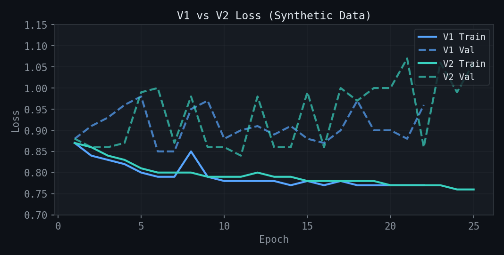

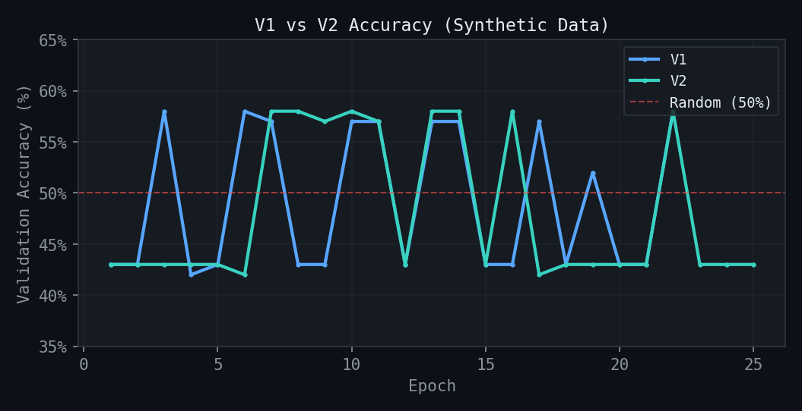

---

## Phase 2: Ground Truth Training (V5-V9)

Switched from synthetic noise to real clean/noisy survey pairs from Seward, Alaska. Four VR BAG pairs with noise percentages ranging from 16% to 34%.

### Loss Curves by Version

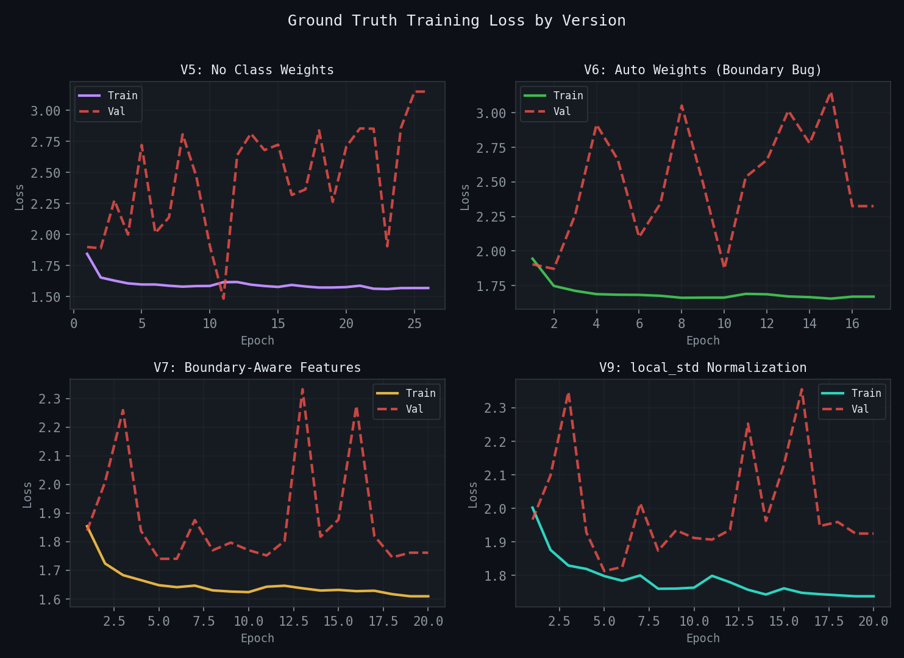

Key observations per version:

- **V5 (purple):** Train loss decreases smoothly but val loss diverges wildly. Model collapsed to all-seafloor prediction (67% accuracy = seafloor proportion). Root cause: missing class weights.
- **V6 (green):** Val loss diverges early. Model learned boundary artifacts instead of real noise. Root cause: `uniform_filter` bleeding nodata into features.
- **V7 (yellow):** Most stable training. Val loss stays bounded. First version to genuinely classify noise spatially. Boundary-aware masked statistics fixed the V6 bug.
- **V9 (teal):** Higher absolute loss values (expected, since correction targets are now in std dev units). Training dynamics similar to V7 because classification head is unchanged.

### Validation Accuracy Comparison

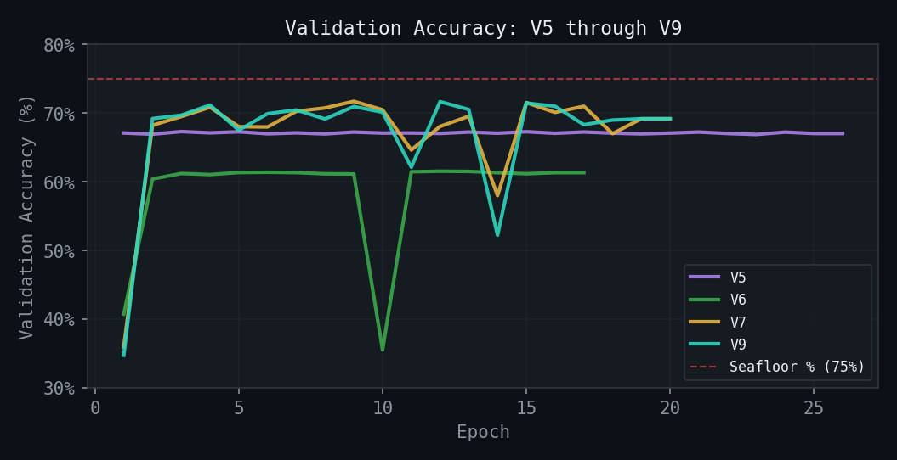

The red dashed line marks the seafloor proportion (75%). V5 sits right at the seafloor proportion, confirming majority-class collapse. V7 and V9 consistently exceed it, indicating genuine classification ability. The V6 dip to ~35% (epoch 10) shows the boundary artifact model periodically "losing" its signal.

### Validation Loss Comparison

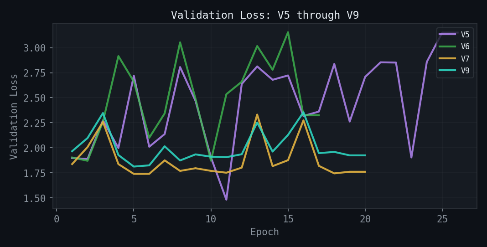

Validation loss diverges from training loss after approximately 5 epochs in every version. This is the persistent overfitting signature from training on a single geographic area (Seward only). Early stopping triggers around epochs 15-25.

---

## Inference Results (Seward 1of4 Unclean)

### Noise Detection Rate

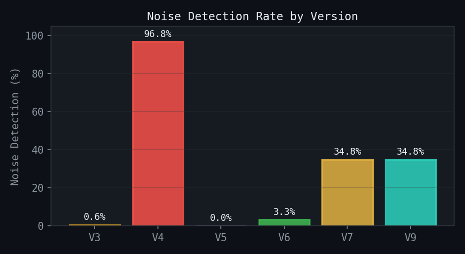

V4 (96.8%) flagged everything as noise -- a failed overcorrection from V3's conservatism. V5 (0.0%) swung to the opposite extreme. V7 and V9 both land at 34.8%, matching the ground truth distribution.

### Mean Confidence

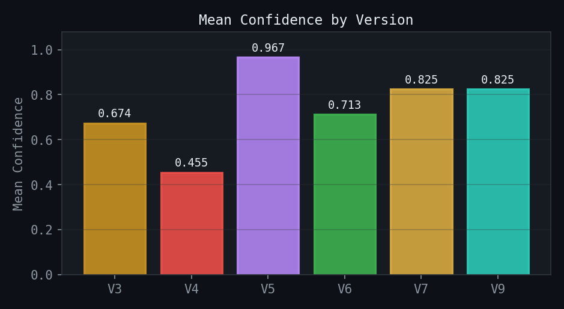

V5's 0.967 confidence is misleading -- the model was "confidently wrong" about everything being seafloor. V7/V9's 0.825 reflects genuine uncertainty where appropriate.

### Auto-Corrections Applied

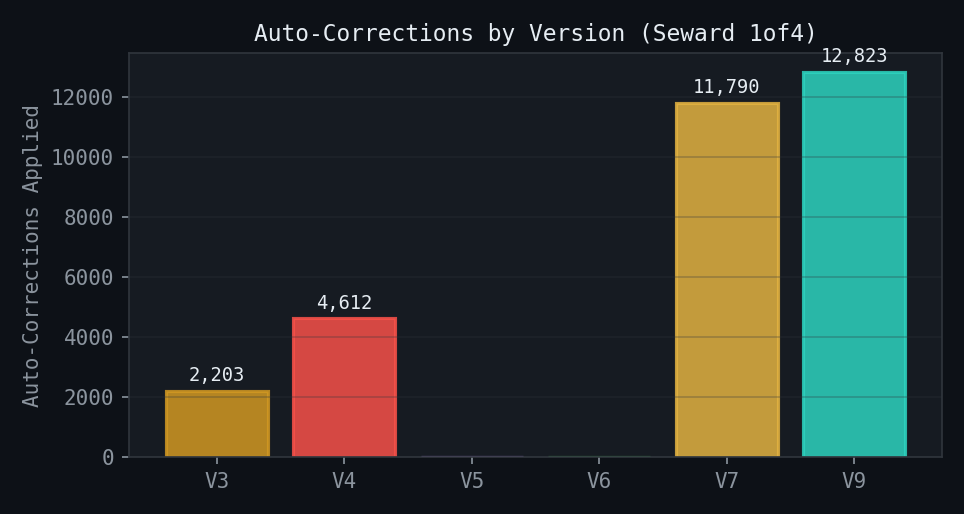

V9 applies 12,823 auto-corrections vs V7's 11,790 (+8.7%). The increase comes from larger correction magnitudes shifting cells near the confidence threshold.

### Best Validation Loss

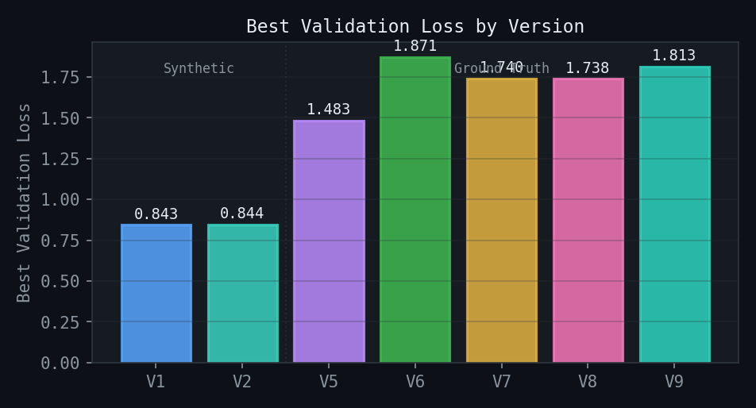

Note the gap between synthetic (V1/V2, ~0.84) and ground truth (V5-V9, 1.4-1.9). Ground truth loss is higher because the real noise classification problem is harder than synthetic noise. The V5 anomaly (lowest GT loss at 1.483) reflects the model "solving" the problem by predicting one class.

---

## Correction Normalization (V9)

V7 correctly identified noise locations but predicted 0.4m corrections where 70m was needed. Huber loss with delta=1.0 gives identical gradient magnitude for errors above 1m, so the model had no incentive to predict large corrections.

V9 normalizes correction targets by per-node local surface variability (local_std). The model learns in relative units (standard deviations), and predictions are denormalized at inference by multiplying by local_std.

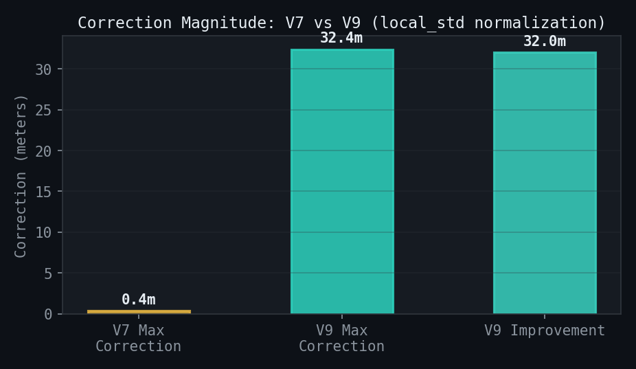

| Stat | Raw | Normalized |
|------|-----|-----------|
| Mean |correction| | 0.302m | 0.676 sigma |
| Max |correction| | 33.10m | 50.0 sigma (capped) |
| 95th percentile | -- | 0.997 sigma |
| Noise cells | 537,940 | -- |
| Normalization floor | 0.01m | -- |
| Cap | -- | +/-50 sigma |

---

## Training Data

### Noise Percentage by Survey Pair

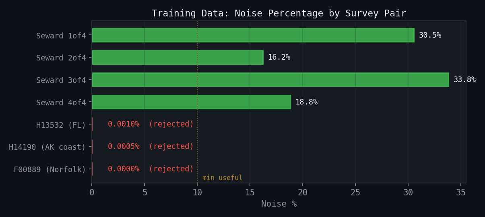

The orange dashed line marks the minimum useful noise threshold (~10%). The four Seward pairs (green) all fall well above it. The three new pairs (red) have effectively zero grid-level noise and were rejected.

### Active Training Pairs (Seward, Alaska)

| Survey | Type | Valid Cells | Noise Cells | Noise % | Role |
|--------|------|------------|------------|---------|------|
| Seward 1of4 | VR | 1,803K | 551K | 30.5% | Training |
| Seward 2of4 | VR | 1,740K | 281K | 16.2% | Training |
| Seward 3of4 | VR | 1,882K | 636K | 33.8% | Training |
| Seward 4of4 | VR | 1,626K | 306K | 18.8% | Validation |

**Combined:** ~5.3M seafloor cells, ~1.8M noise cells (~75/25 split)

### Rejected Pairs (2026-03-02)

| Survey | Type | Location | Valid Cells | Noise Cells | Noise % | Reason |
|--------|------|----------|------------|------------|---------|--------|
| H13532 | SR 1m | Florida (river) | 456K | 4 | 0.00% | No grid-level noise |
| H14190 | VR | Alaska (coastal) | 30,250K | 149 | 0.00% | No grid-level noise |
| F00889 | SR 0.5m | Norfolk (river) | 23,573K | 1 | 0.00% | No grid-level noise |

The gridded BAG surfaces are nearly identical between clean and dirty versions. CUBE's robust gridding algorithm likely already rejected the outlier soundings during surface generation. This model operates on gridded surfaces, so noise that only exists in the point cloud cannot be detected or learned from.

---

## Architecture

| Component | Detail |
|-----------|--------|
| Model | Graph Attention Network (GAT) |
| Layers | 4 |
| Hidden channels | 64 |
| Parameters | 182K |
| Node features (8) | depth, local mean, local std, gradient magnitude, gradient direction, curvature, uncertainty, boundary distance |
| Edge features (3) | distance, depth difference, slope angle |
| Output heads | classification (3-class), confidence (0-1), correction (meters, normalized by local_std) |
| Loss | Weighted cross-entropy + shoal safety asymmetric + Huber (on normalized corrections) |

---

## Persistent Issues

**Overfitting:** Validation loss diverges from training loss after ~5 epochs in every ground truth run (V5-V9). All training data is from Seward, Alaska. The model memorizes location-specific patterns rather than learning generalizable noise signatures.

**Classification plateau:** ~72% accuracy against 75% seafloor proportion means the model is only marginally better than always predicting seafloor. Both false positives and false negatives are present.

**Correction magnitude gap:** V9 corrections are up to 32m larger than V7, but still don't fully recover the clean reference surface.

---

## Next Steps

1. **Find diverse training data** -- Survey pairs where noise is visible in the gridded BAG surface, from varied geographic locations and depth regimes. Quick test: subtract surfaces in QGIS raster calculator and look for scattered spikes.
2. **Sounding density feature** -- Per-cell sounding count from point cloud data would be the strongest noise discriminator. Single-hit cells in the surface are almost certainly noise.
3. **Validate V9 corrections** -- Quantify how close V9 corrections come to recovering the clean surface at known noise locations.
4. **Adaptive Huber delta** -- Options documented in `training/losses.py` for future implementation once diverse data is available.

---

*Dashboard v2.0 | March 2026*
