# Bathymetric GNN -- Training Performance Tracker

**V1-V10 | Seward, Alaska + Pacific Islands | VR/SR BAG Noise Detection | Updated 2026-05-20**

---

## Version Overview

| Version | Key Change | Val Accuracy | Noise Det. | Confidence | Auto-Corr | Status |
|---------|-----------|-------------|-----------|-----------|----------|--------|
| V1 | Baseline (7 features) | 47.7% | -- | -- | -- | Synthetic |
| V2 | +uncertainty (8 features) | 48.6% | -- | -- | -- | Synthetic |
| V3 | +shoal safety loss | -- | 0.6% | 0.674 | 2,203 | Too conservative |
| V4 | Manual 2x noise weight | -- | 96.8% | 0.455 | 4,612 | :x: All-noise |
| V5 | No class weights (bug) | ~67% | 0.0% | 0.967 | 0 | :x: All-seafloor |
| V6 | Auto class weights | ~61% | 3.3% | 0.713 | 0 | :warning: Boundary bug |
| **V7** | **Boundary-aware features** | **~72%** | **34.8%** | **0.825** | **11,790** | :star: Best classification detection |
| V8 | Dynamic Huber delta | = V7 | = V7 | = V7 | = V7 | No change |
| **V9** | **local_std correction norm** | **~72%** | **34.8%** | **0.825** | **12,823** | :star: Best classification corrections |
| **V10** | **Regression mode** | N/A (MAE 0.83 std-dev) | N/A | N/A | per cell | :test_tube: Initial run successful (5 epochs, 1 survey) |

V10 uses regression instead of classification. Metrics are not directly comparable to V1-V9: the model predicts a continuous correction at every cell rather than a class label. MAE replaces accuracy as the primary metric.

---

## Phase 1: Synthetic Noise Training (V1, V2)

Both models oscillated around 48% validation accuracy (near random). Adding uncertainty as the 8th feature gave negligible improvement. Synthetic noise did not capture real acoustic artifact characteristics.

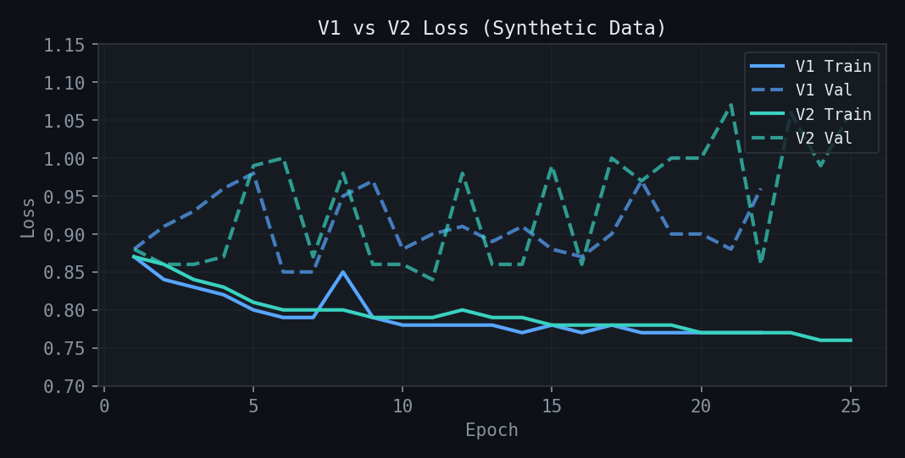

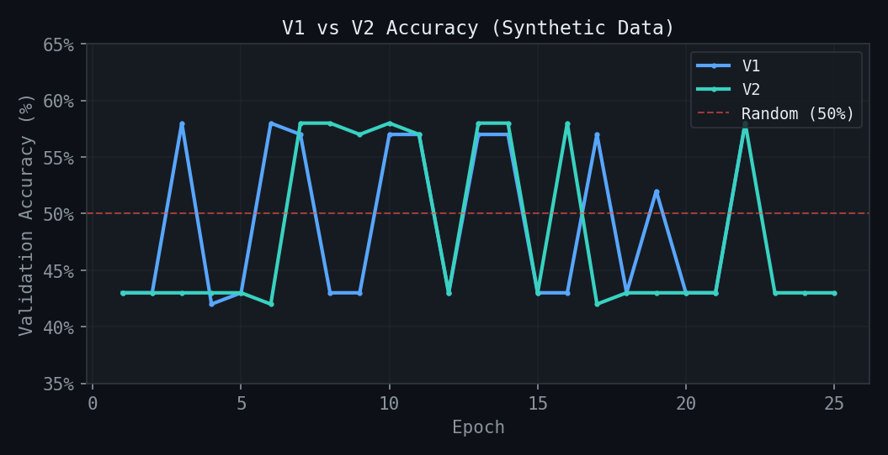

---

## Phase 2: Ground Truth Training (V5-V9)

Switched from synthetic noise to real clean/noisy survey pairs from Seward, Alaska. Four VR BAG pairs with noise percentages ranging from 16% to 34%.

### Loss Curves by Version

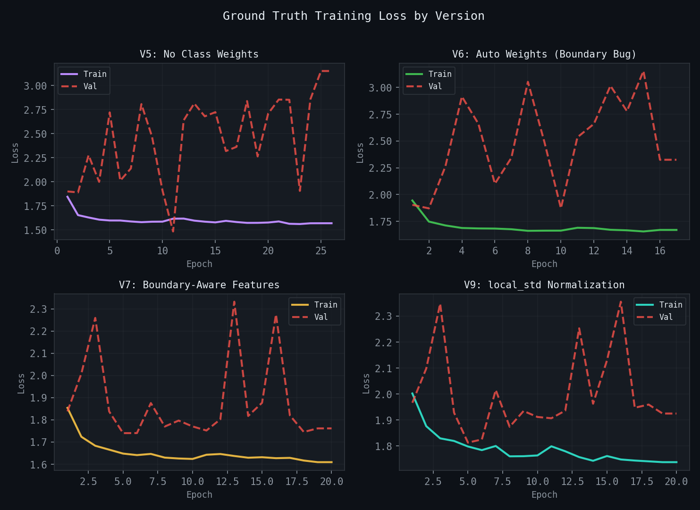

Key observations per version:

- **V5 (purple):** Train loss decreases smoothly but val loss diverges wildly. Model collapsed to all-seafloor prediction (~67% accuracy). Inference confirmed 0% noise detection. Root cause: missing class weights.
- **V6 (green):** Val loss diverges early. Model learned boundary artifacts instead of real noise. Root cause: `uniform_filter` bleeding nodata into features.
- **V7 (yellow):** Most stable training. Val loss stays bounded. First version to genuinely classify noise spatially. Boundary-aware masked statistics fixed the V6 bug.
- **V9 (teal):** Higher absolute loss values (expected, since correction targets are now in std dev units). Training dynamics similar to V7 because classification head is unchanged.

### Validation Accuracy Comparison

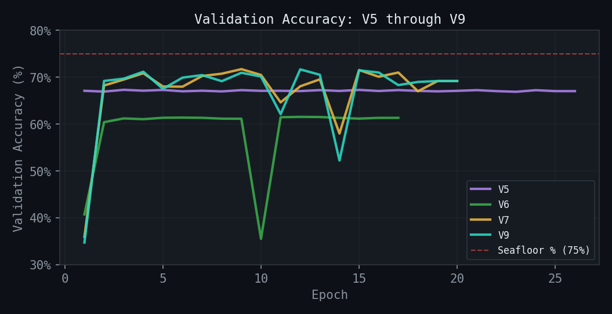

The red dashed line marks the seafloor proportion (75%). V5 sits below the line at ~67%, consistent with majority-class-like collapse (inference confirmed 0% noise detection). V7 and V9 land slightly below it (~72%), which is expected: they trade some seafloor accuracy for genuine noise detection (34.8%). The accuracy dip below 75% reflects false positives (seafloor misclassified as noise), but the model is doing useful work because it's actually finding noise cells. However, 34.8% detection against the validation set's 18.8% actual noise rate indicates the model is over-predicting noise, nearly doubling the true rate. The V6 dip to ~35% (epoch 10) shows the boundary artifact model periodically "losing" its signal.

### Validation Loss Comparison

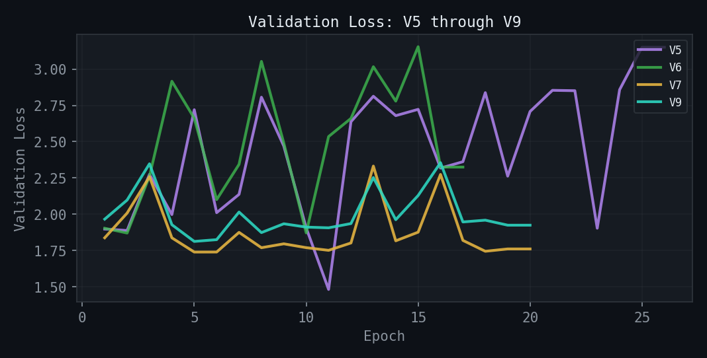

Validation loss diverges from training loss after approximately 5 epochs in every version. This is the persistent overfitting signature from training on a single geographic area (Seward only). Early stopping triggers around epochs 15-25.

---

## Inference Results (Seward 1of4 Unclean)

### Noise Detection Rate

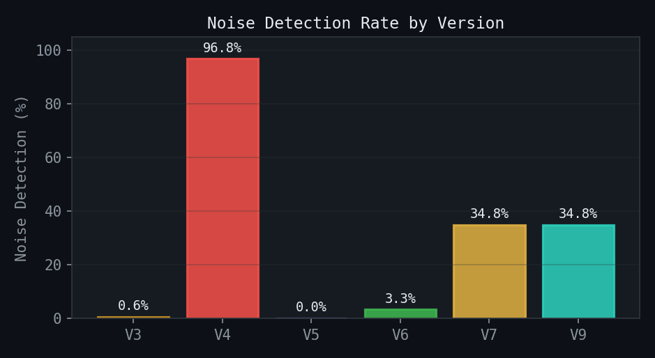

V4 (96.8%) flagged everything as noise -- a failed overcorrection from V3's conservatism. V5 (0.0%) swung to the opposite extreme. V7 and V9 both land at 34.8%, which represents genuine noise detection but is nearly double the validation set's actual noise rate of 18.8%. This over-prediction indicates a significant false positive rate, likely from the model learning Seward-specific seafloor patterns as noise-like. Geographic diversity in training data is the expected path to reducing these false positives.

### Mean Confidence

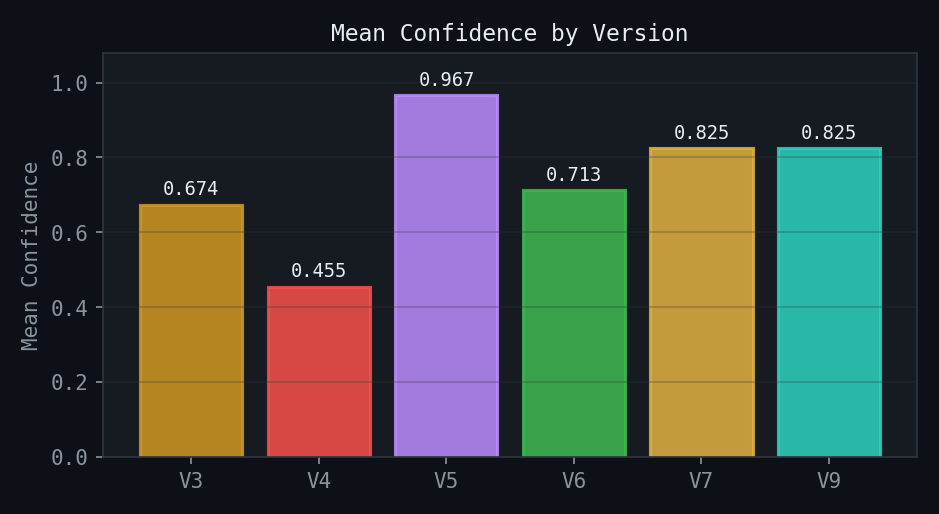

V5's 0.967 confidence is misleading -- the model was "confidently wrong" about everything being seafloor. V7/V9's 0.825 reflects genuine uncertainty where appropriate.

### Auto-Corrections Applied

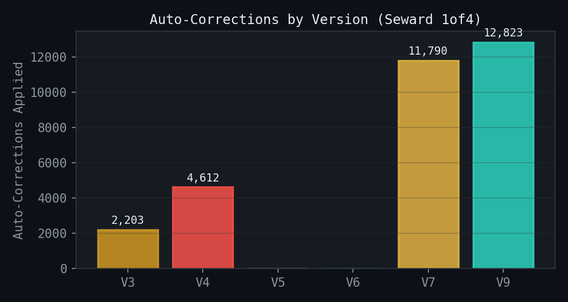

V9 applies 12,823 auto-corrections vs V7's 11,790 (+8.7%). The increase comes from larger correction magnitudes shifting cells near the confidence threshold.

### Best Validation Loss

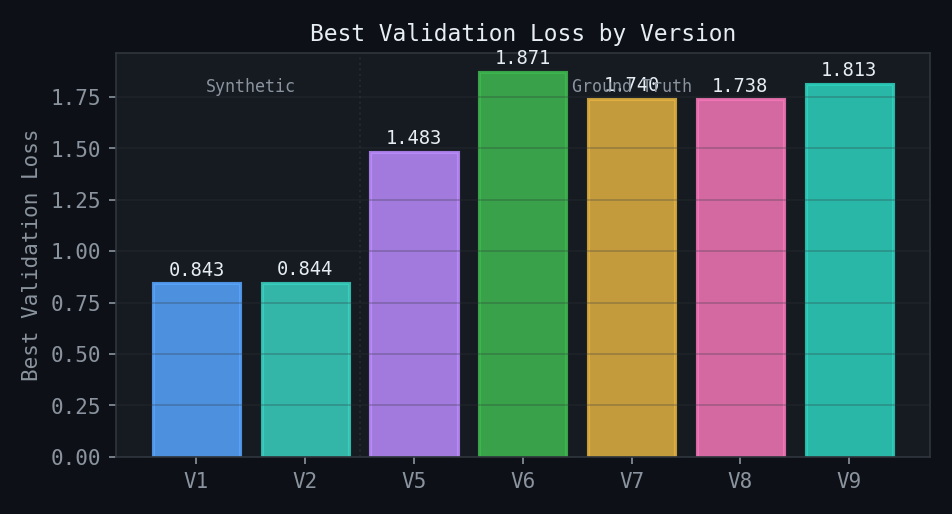

Note the gap between synthetic (V1/V2, ~0.84) and ground truth (V5-V9, 1.4-1.9). Ground truth loss is higher because the real noise classification problem is harder than synthetic noise. The V5 anomaly (lowest GT loss at 1.483) reflects the model "solving" the problem by predicting one class.

---

## Correction Normalization (V9)

V7 correctly identified noise locations but predicted 0.4m corrections where 70m was needed. Huber loss with delta=1.0 gives identical gradient magnitude for errors above 1m, so the model had no incentive to predict large corrections.

V9 normalizes correction targets by per-node local surface variability (local_std). The model learns in relative units (standard deviations), and predictions are denormalized at inference by multiplying by local_std.

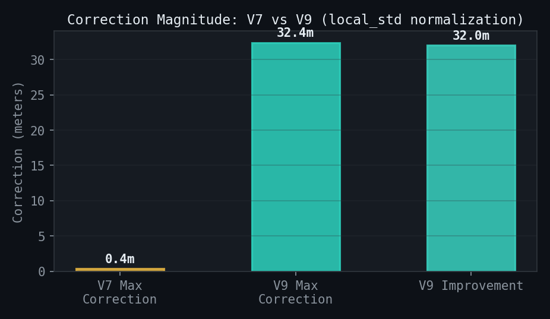

| Stat | Raw | Normalized |
|------|-----|-----------|
| Mean |correction| | 0.302m | 0.676 sigma |
| Max |correction| | 33.10m | 50.0 sigma (capped) |
| 95th percentile | -- | 0.997 sigma |
| Noise cells | 537,940 | -- |
| Normalization floor | 0.01m | -- |
| Cap | -- | +/-50 sigma |

---

## Phase 3: Regression Mode (V10)

V10 is a structural shift away from binary classification toward continuous regression. The model now predicts the depth correction at every cell rather than classifying cells into noise/seafloor buckets and then predicting corrections only for noise cells.

### Why Regression

Classification forces a binary decision on a continuous signal. Cells near the threshold boundary get inconsistent labels for nearly identical real-world cases, and the correction head only trains on cells labeled noise, so it never learns to predict near-zero corrections for cells that don't need them. The threshold value also determines what the model learns, but the threshold is arbitrary even when computed adaptively.

Regression preserves the full continuous signal. Every valid cell contributes to the loss with its raw difference as the target. The model learns to predict small corrections for cells that barely changed between clean and noisy surfaces, and large corrections for cells that changed significantly. At inference, the operational threshold moves to a decision about which predicted corrections are worth applying, rather than a training-time decision about which cells count as noise.

### Architecture Changes

The model architecture is unchanged. It still outputs class_logits, predicted_class, confidence, and correction. In regression mode, only the correction head's output drives the loss. The classification head still computes outputs but they don't contribute to gradients.

- `prepare_ground_truth.py --regression-mode`: produces files with band 1 = valid_mask, band 2 = correction target (continuous, no threshold), bands 3-5 unchanged
- Output filename suffix: `_regression.tif` (vs `_ground_truth.tif`) so both modes coexist
- `RegressionLoss`: asymmetric Huber penalty on every valid cell, with shoal safety baked into the loss direction (predictions leaving the corrected surface deeper than reality get 3x penalty)
- `BathymetricGNNLoss` dispatches on `targets['mode']`
- `GroundTruthDataset` auto-detects mode from band 1 description
- Training tracks MAE instead of accuracy in regression mode

### V10 Initial Training Run (2026-05-20)

| Metric | Value |
|--------|-------|
| Training data | E00269 sub-file 1of6 (1 survey, 4m SR) |
| Tile size | 256 x 256 |
| Batch size | 2 |
| Tiles | 91 |
| Epochs | 5 |
| Train loss curve | 0.787 -> 0.735 -> 0.712 -> 0.699 -> 0.686 |
| MAE (normalized) | ~0.83 std-dev units |
| Validation | None (only 1 file available) |

The loss decreased steadily across all 5 epochs with no signs of divergence or instability. MAE stayed flat at ~0.83 std-dev units, which is expected over so few epochs on a single survey. The pipeline ran end-to-end without error, confirming the regression-mode architecture, dataset, and training loop are correctly wired.

### V10 Ground Truth Generation

All six E00269 sub-files processed in regression mode:

| Sub-file | Resolution | Valid Cells | Mean Correction | Max Correction | Offset Removed |
|----------|------------|-------------|-----------------|----------------|----------------|
| 1of6 | 4m SR | 918,831 | 0.30m | 16.49m | -0.51m |
| 2of6 | 8m SR | 356,601 | 0.53m | 88.00m | -0.20m |
| 3of6 | 8m SR | 3,214,339 | 0.50m | 605.64m | -0.41m |
| 4of6 | 128m SR | 11,390,629 | 83.84m | 4934.40m | +5.91m |
| 5of6 | 128m SR | 1,118,639 | 6.77m | 775.70m | +0.42m |
| 6of6 | 256m SR | 59,793 | 17.97m | 552.44m | -0.15m |

Correction magnitudes scale with resolution and water depth, as expected. The local_std normalization (carried over from V9) handles this scaling automatically during training: each cell's correction target is divided by its local depth variability, so the model learns in std-dev units across all depth regimes.

H13739 (Pacific Islands VR, deep water trackline) processed separately with classification adaptive threshold (`--adaptive-threshold --no-offset`). Will be reprocessed in regression mode for V10 training.

### V10 Evaluation Metrics

Classification metrics (accuracy, precision, recall, F1) do not apply to V10 because the model outputs continuous corrections, not class labels. Post-hoc thresholding to compute classification metrics would reintroduce the arbitrary-threshold problem that V10 was designed to avoid.

V10 uses regression metrics defined in `training/metrics.py`:

- **MAE and RMSE** in meters and normalized to local_std units
- **Per-magnitude-bucket MAE** (< 0.1m, 0.1-1m, 1-10m, > 10m): separates small-correction performance from large-correction performance, where the large buckets are operationally critical
- **Hazardous error rate**: fraction of cells where the predicted correction is smaller than the true correction (which would leave the corrected depth deeper than reality, a navigation hazard). Tracked overall and separately for shoal-direction and deep-direction targets.
- **Recovery RMSE**: RMS of (corrected surface - clean surface) across valid cells. Single-number operational summary that allows direct comparison against V9.

See HOW_IT_WORKS.md for the full rationale behind each metric and what stays outside the model's responsibility (IHO compliance, charted feature preservation).

### V10 Multi-File Training and Resolution Feature (2026-05-27/28)

First full multi-file V10 run used 4 E00269 sub-files for training (1of6, 3of6, 4of6, 6of6) and 2 for validation (2of6 shallow + 5of6 deep). Best model at epoch 4, early stopping at epoch 18 (overfitting, expected with one geographic location).

Two model versions were trained on identical data and split, differing only in the presence of the `log_footprint` resolution feature:

**Best validation loss:** 1.64 (baseline) -> 1.31 (with resolution feature)

Evaluation split by regime (using `scripts/evaluate_v10.py` on each validation file separately):

Shallow water (2of6, 8m):

| Metric | Baseline | With resolution feature |
|--------|----------|------------------------|
| Overall MAE | 1.99m | 0.87m |
| MAE <0.1m bucket | 1.39m | 0.52m |
| MAE 0.1-1m bucket | 1.86m | 0.79m |
| MAE 1-10m bucket | 3.53m | 1.74m |
| Recovery RMSE | 3.40m | 1.56m |
| Recovery mean error | -2.16m | -0.94m |
| Hazardous rate (shoal) | 0.00% | 0.00% |

Deep water (5of6, 128m):

| Metric | Baseline | With resolution feature |
|--------|----------|------------------------|
| Overall MAE | 28.09m | 26.59m |
| MAE <0.1m bucket | 27.35m | 24.44m |
| MAE >10m bucket | 37.69m | 35.92m |
| Recovery RMSE | 46.81m | 40.05m |
| Recovery mean error | -23.76m | -23.53m |

Shallow water error roughly halved with no cost to shoal safety. Deep water improved only marginally, with per-bucket MAE remaining flat (~24m across all magnitude buckets), indicating the model still outputs a default magnitude rather than discriminating by need. The deep regime is data-limited (one 128m survey), not architecture-limited.

The split-by-regime evaluation was essential here. The blended overall MAE (21.7m baseline) was dominated by deep water and masked the genuinely good shallow performance. Evaluating each regime separately revealed that the model is operationally promising in shallow water and not yet working in deep water, which a single aggregate number could not show.

### V10 Next Validation

The 5-epoch initial run validated the pipeline. The next training run should:

1. Process more E00269 sub-files (2-6) in regression mode for 6 total files
2. Add H13739 in regression mode for cross-geography diversity
3. Run 50-100 epochs with train/val split (multi-file requirement met)
4. Compare V10 performance against V9 on the Seward validation set after V10 trains on regression-mode Seward data

---

## Training Data

### Noise Percentage by Survey Pair

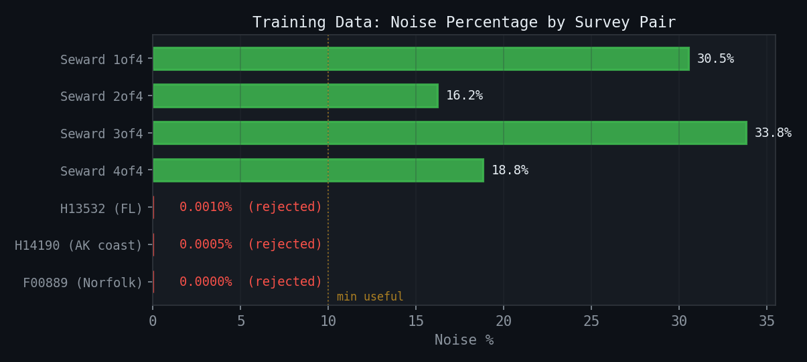

The orange dashed line marks the minimum useful noise threshold (~10%). The four Seward pairs (green) all fall well above it. The three new pairs (red) have effectively zero grid-level noise and were rejected.

### Active Training Pairs (Seward, Alaska)

| Survey | Type | Valid Cells | Noise Cells | Noise % | Role |
|--------|------|------------|------------|---------|------|
| Seward 1of4 | VR | 1,803K | 551K | 30.5% | Training |
| Seward 2of4 | VR | 1,740K | 281K | 16.2% | Training |
| Seward 3of4 | VR | 1,882K | 636K | 33.8% | Training |
| Seward 4of4 | VR | 1,626K | 306K | 18.8% | Validation |

**Combined:** ~5.3M seafloor cells, ~1.8M noise cells (~75/25 split)

### Rejected Pairs (2026-03-02)

| Survey | Type | Location | Valid Cells | Noise Cells | Noise % | Reason |
|--------|------|----------|------------|------------|---------|--------|
| H13532 | SR 1m | Florida (river) | 456K | 4 | 0.00% | No grid-level noise |
| H14190 | VR | Alaska (coastal) | 30,250K | 149 | 0.00% | No grid-level noise |
| F00889 | SR 0.5m | Norfolk (river) | 23,573K | 1 | 0.00% | No grid-level noise |

The gridded BAG surfaces are nearly identical between clean and dirty versions. CUBE's robust gridding algorithm likely already rejected the outlier soundings during surface generation. This model operates on gridded surfaces, so noise that only exists in the point cloud cannot be detected or learned from.

---

## Architecture

| Component | Detail |
|-----------|--------|
| Model | Graph Attention Network (GAT) |
| Layers | 4 |
| Hidden channels | 64 |
| Parameters | 182K |
| Node features (8) | depth, local mean, local std, gradient magnitude, gradient direction, curvature, uncertainty, boundary distance |
| Edge features (3) | distance, depth difference, slope angle |
| Output heads | classification (3-class), confidence (0-1), correction (meters, normalized by local_std) |
| Loss | Weighted cross-entropy + shoal safety asymmetric + Huber (on normalized corrections) |

---

## Data Acquisition Plan (2026-03-04)

22 surveys identified across 8 regions to address the geographic diversity gap. Clean BAGs will be downloaded from NCEI. Processed (pre-cleaning) data requested from the NCEI archive to produce noisy BAGs for training pairs. One survey (E00269) is available locally and can be processed immediately.

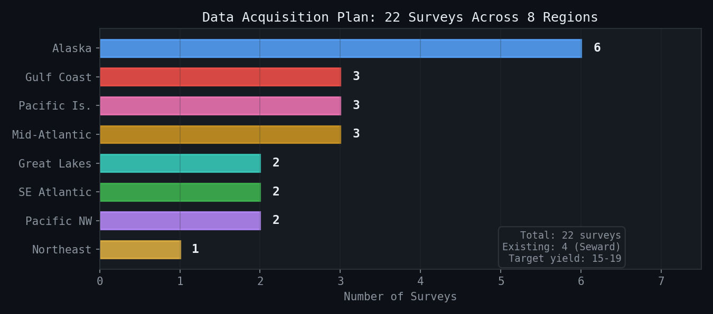

### Target Surveys by Region

| Region | Count | Registry Numbers | Environment |
|--------|-------|-----------------|-------------|
| Gulf Coast Shallow (TX/LA/MS/FL) | 3 | H13818, H13651, H13837 | Shallow saltwater, warm water refraction, post-storm dynamics |
| Southeast Atlantic (SC/GA) | 2 | H13851, F00881 | Sandy, tidal, dynamic bottom |
| Mid-Atlantic (MD/VA/NC) | 3 | H13762, H13804, H13750 | Estuarine, mixed bottom, current-affected |
| Northeast (NY/CT/RI) | 1 | H13927 | Rocky/sand mixed, different acoustic environment |
| Great Lakes | 2 | H13940, H13943 | Freshwater, glacial sediment, shallow, thermocline refraction |
| Pacific NW (WA/OR) | 2 | H14070, H13847 | Rocky, deep, cold saltwater |
| Alaska | 6 | H13774, F00886, H14116, H13914, E01093, H13695 | Mixed: shallow flat (set line spacing), Bering Sea/North Slope (trackline), plus standard multibeam |
| Pacific Islands | 3 | H13739, H13735, E00269 | Coral/volcanic substrate, warm shallow water, Northern Mariana Islands |

### Acquisition Status

| Source | Surveys | Status |
|--------|---------|--------|
| NCEI archive (clean BAGs) | 21 | Download directly |
| NCEI archive (processed data) | 21 | Requested, awaiting delivery (days to weeks) |
| Local data (E00269, N. Mariana Islands) | 1 | :white_check_mark: All 6 sub-files processed in both classification and regression modes |
| Pacific Islands (H13739) | 1 | :white_check_mark: Processed in classification mode; needs reprocessing in regression mode |

### Processing Plan

**Immediate:** Process E00269 locally. Run QGIS difference-layer check first.

**As data arrives:** Prioritize one survey per region before processing all surveys from any single region. This reveals early if any region consistently produces unusable pairs. Suggested first batch: one Gulf Coast, one Great Lakes, one Pacific Islands.

**Quality gate:** For each pair, subtract surfaces in QGIS raster calculator before running `prepare_ground_truth.py`. If the difference layer is uniformly near zero, reject the pair. Target 10-40% noise in the gridded surface.

**Expected yield:** At ~30-50% attrition (near-zero grid noise), expect 11-15 usable pairs. Combined with 4 existing Seward pairs, that would give 15-19 total training pairs from 8+ distinct environments.

### Training Value by Region

| Region | Key Diversity Contribution |
|--------|---------------------------|
| Gulf Coast | Shallow water noise regime, warm water refraction artifacts |
| SE / Mid-Atlantic | Sandy/estuarine bottom, tidal current effects |
| Northeast | Rocky New England coast, different from Alaska rocky |
| Great Lakes | Freshwater acoustics, glacial sediment, no tidal corrections |
| Pacific NW | Deep cold saltwater, volcanic/rocky substrate |
| Alaska (non-Seward) | Validates generalization within Alaska; trackline and set-line-spacing survey types add acquisition geometry diversity |
| Pacific Islands | Coral/volcanic, warm shallow, most acoustically distinct from Seward |

---

## Persistent Issues

**Overfitting:** Validation loss diverges from training loss after ~5 epochs in every ground truth run (V5-V9). All training data is from Seward, Alaska. The model memorizes location-specific patterns rather than learning generalizable noise signatures. The data acquisition plan above is the primary mitigation.

**Classification plateau and noise over-prediction:** ~72% overall accuracy is slightly below the 75% seafloor proportion. The model detects noise at 34.8%, nearly double the validation set's actual 18.8% noise rate. This means the model is making more corrections than necessary, flagging real seafloor as noise. The model trades some seafloor accuracy for noise detection, but needs to become more precise. Geographic diversity in training data should tighten the decision boundary. Additionally, tracking precision and recall separately (rather than just overall detection rate) would better diagnose whether the priority is reducing false positives or improving true positive detection.

**Correction magnitude gap:** V9 corrections are up to 32m larger than V7, but still don't fully recover the clean reference surface.

---

## Next Steps

1. :white_check_mark: **Process E00269 (N. Mariana Islands)** -- Done. All 6 sub-files processed in classification (adaptive threshold) and regression modes.
2. :white_check_mark: **First V10 training run** -- Done. Pipeline validated end-to-end on E00269 1of6.
3. :star: **Convert H13739 to regression mode** -- Already processed in classification mode; rerun with `--regression-mode --no-offset` for V10 training.
4. **Process archive data as it arrives** -- One per region first, run QGIS difference-layer pre-check on each. Use `--regression-mode --no-offset` for V10 training data when both surfaces are in the same datum.
5. **Train V10 on multi-region data** -- Once 6+ regression-mode files exist (covering Seward + E00269 + H13739 + new pairs), run 50-100 epoch training with proper train/val split. Compare against V9 on Seward validation set.
6. **Reprocess Seward pairs in regression mode** -- The existing 4 Seward classification-mode files can be regenerated with `--regression-mode` to integrate into the V10 training set. This is fast since the BAGs are already on disk.
7. **Update inference pipeline for V10** -- `inference_native.py` currently uses classification + confidence thresholding. Add a regression-mode inference path: predict correction at every cell, denormalize by local_std, apply where magnitude exceeds an operational threshold.
8. **Add precision/recall metrics (V9 classification mode)** -- Track precision and recall separately to diagnose false positive vs false negative balance, useful even alongside V10 development.
9. **Sounding density feature** -- Per-cell sounding count from point cloud data would be the strongest noise discriminator. Single-hit cells in the surface are almost certainly noise.
10. **Validate corrections in QGIS** -- Quantify how close V9 and V10 corrections come to recovering the clean surface at known noise locations. Build a side-by-side comparison once V10 has a trained model worth evaluating.

---

*Dashboard v3.0 | May 2026*
